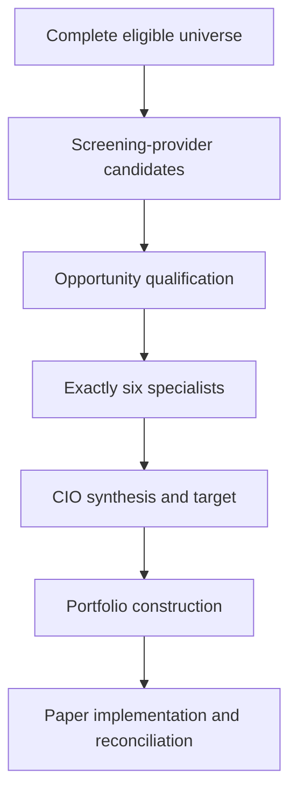

# Candidate Funnel Analysis

## Active-path finding

The active funnel is structurally fail-closed but previously lacked one reconciled per-cycle observation. Screening records exclusions and opportunity qualification records rejections; specialist packets, CIO decisions, construction results, and paper fills are separately append-only. Phase 1 connects their identifiers without changing any stage.

## Exact active contracts

| Funnel boundary | Pass condition | Fail/no-action evidence | Authority |
|---|---|---|---|
| Universe to screening | Authoritative point-in-time security master and exact metric coverage | Screening cycle failure; no partial publication | Data governance only |
| Screening provider to candidate set | `CandidateScreeningDecision.candidate` exists | Instrument exclusion reasons | Screening only |
| Candidate to opportunity queue | Universe, evidence, liquidity, downside, costs, robustness, and alternative comparisons satisfy the active lane | `CandidateQualification.reasons` | No portfolio authority |
| Queue to specialists | Persisted ranking matches the runtime ranking and a production context exists for each ranked candidate | Cycle fails closed on context mismatch | Six analysts; no action authority |
| Specialists to CIO | Packet contains exactly the six governing roles | Evidence vetoes, implementation blocks, dissent, or abstention | Specialists cannot issue a trade |
| CIO to initial target | CIO issues a material action and target | Structured action plus rationale | CIO only |
| Initial to final target | Complete portfolio remains feasible and improves after costs and scenarios | Construction blocks and constraints | Construction may reduce or reject, never originate authority |
| Construction to paper state | Exact paper construction passes authorization, quote, execution, and reconciliation controls | Paper execution events/status | Paper-only transport |

## Measurement semantics

“Decision eligible” means the screening provider created a complete candidate record; it does not mean that the candidate cleared opportunity qualification. “Complete evidence” is separately measured so an evidence failure cannot be hidden inside a general screening conversion rate. “Committee synthesis” currently means a complete six-role packet was delivered into CIO synthesis; the code has no separate voting committee that can independently authorize an action. Whether that direct packet-to-CIO design loses disagreement information is a Phase 2 question.

The paper-implementation count is intentionally incomplete at the decision boundary. Later canonical simulated fills are joined by the immutable CIO decision identifier. Alpaca paper transport validation is not treated as canonical internal implementation, and no live-money event qualifies.

## Current measurable baseline

No live Render journal was included in the repository or uploaded comparison artifact. Consequently, conversion rates, time in cash, candidate counts, and reason frequencies are not yet reported as observed facts. Test fixtures demonstrate the instrumentation behavior but are not performance evidence and are excluded from the production denominator.

## Acceptance criteria

- Eligible count equals decision-eligible plus excluded observations.
- Every opportunity candidate is either ranked or rejected exactly once.
- Every ranked candidate that reaches a decision records exactly six specialist roles.
- Every CIO decision has a matching point-in-time snapshot.
- A positive CIO target that becomes zero is explicitly classified as `approved_target_reduced_to_zero`.
- Missing post-cycle fills remain `not_observed_at_decision_boundary`, not an execution failure.
- Replaying an identical cycle identifier appends no duplicate diagnostic event.

## Rollback and authority

Rollback is code-only; diagnostic history remains append-only. Investment behavior changed: **no**. CIO, construction, governance, execution, and real-money authority changed: **no**.

