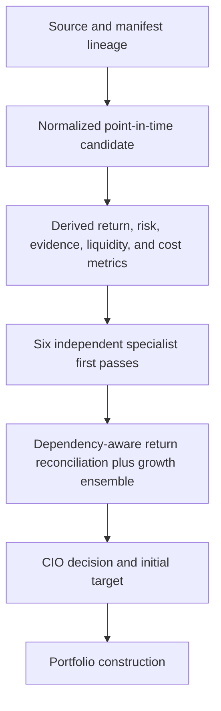

# Committee and CIO Audit

## Decision status

The six-specialist and CIO path is structurally complete, but its persisted decision packet is not yet sufficient to declare that persistent cash is always an informed, non-duplicative choice. No production journal was included in the repository, so this is a source-and-contract audit plus forward instrumentation, not a measured claim about live decisions.

The new `committee-cio-information-trace.v1` event freezes source lineage, the normalized candidate, derived metrics, each specialist input/output, origin overlap, return-reconciliation adjustment, CIO sufficiency, initial target, and construction result after the decision. It has no decision or execution authority.

## Active evidence path

There is no separate voting committee with investment authority. “Committee synthesis” consists of an exact six-role packet, dependency-aware return reconciliation, robustness, and the adaptive growth ensemble inside the CIO service. The CIO alone issues the canonical action.

## Six-specialist audit

| Specialist | Required and actually supplied inputs in the active contract | Unique contribution | Confidence method | Missing/stale behavior | Veto or sizing effect |
|---|---|---|---|---|---|
| Macro Economic Strategist | Macro regime, impact, confidence, tailwinds/headwinds, systemic risks, scenarios, evidence IDs | Regime and systemic-risk return context | Governed macro confidence, capped by historical learning | Production context must exist; the role does not independently recompute macro age | Directional return adjustment, ensemble alignment, median confidence; no veto |
| Market Strategist | Regime, trend, momentum, breadth, liquidity, positioning, evidence, risks, entry conditions | Technical/participation/positioning/liquidity condition | Governed market confidence, capped by historical learning | Candidate market-data staleness is policed by evidence governance | Directional return adjustment, ensemble alignment, median confidence; no veto |
| Cross-Asset Forecast Specialist | Horizon, calibration, model agreement, stability, scenario probabilities/impacts/path drawdowns, dependencies | Forward distribution and path-risk translation | Minimum of aggregate confidence, calibration, agreement, stability, and horizon alignment; historical ceiling | Missing or failed quality gates cause abstention and zero impact | Scenario-specific reconciliation, ensemble coverage/alignment; no veto |
| Fundamental & Valuation Analyst | Company analysis for direct equities or asset-specific valuation for wrappers/other assets | Independent valuation, quality, growth, earnings-quality and return-driver challenge | Asset valuation confidence, or minimum of company/quality/valuation factor confidence; historical ceiling | Missing valuation causes abstention; missing U.S.-equity company analysis also triggers evidence veto | Directional adjustment, ensemble alignment, median confidence; no direct veto |
| Portfolio & Risk Manager | Current portfolio/cash, exposure profile, scenario construction preview, constraints, costs, funding, risk budget | Feasible ceiling, marginal portfolio effect, funding and implementation feasibility | Weakest evidence dimension when feasible, otherwise 40%; historical ceiling | No feasible target causes abstention; explicit blocks cause opposition | Sole specialist allowed to propose size/funding and implementation blocks; cannot issue CIO action |
| Evidence & Governance Officer | Six quality dimensions, data age, identifiers, models, review boundary, valuation coverage | Reproducibility, freshness, completeness, integrity and lineage | Weakest evidence dimension; historical ceiling | Low quality, stale data, missing IDs/models or invalid timing creates categorized veto | Sole evidence-veto authority; veto blocks new/increased exposure but cannot issue an action |

## Specialist input findings

1. The active production builder requires exact context coverage for every ranked candidate and fails closed on mismatches. Forecast support is attached through the governed forecast-support provider; company or asset valuation is required by the canonical adapter.
2. Portfolio context is generated from the canonical state and a scenario-aware construction preview. The specialist packet persists the output, but the complete structured exposure/risk-budget input is not frozen in the CIO decision itself.
3. Portfolio-risk analyses currently declare no evidence-origin identifiers. Their constraint evidence is preserved as text, so cross-role origin overlap involving portfolio evidence cannot be measured completely.
4. Macro and market roles trust the certified context and do not each perform a distinct source-age check. Evidence governance applies candidate market-data age; per-category macro/market age is therefore upstream rather than role-local.
5. Only the strongest opposing directional analysis is promoted to `MaterialDissent` on the CIO decision. All analyses remain in the specialist packet, but the decision record alone does not preserve the full disagreement distribution.

## Correlated opinion finding

Correlated opinions are treated in two different ways:

- The return reconciler expands declared evidence dependencies, counts shared origins, and discounts each role’s return impact before applying a total adjustment cap. This is dependency-aware.
- The growth ensemble counts the four directional roles as separate engines when computing coverage, supportive ratio, confidence, alignment, dispersion, and stage. CIO final confidence also uses median specialist confidence, directional support, and coverage. Those calculations do not apply the reconciliation overlap discount.

Therefore correlated opinions are **partly treated as independent confirmation**. This is not enough evidence to alter the strategy, but it is a required Phase 3 ablation target.

## CIO information audit

The CIO receives the full candidate, universe assessment, six-role packet, best capital alternative, prior context, and lane. Expected return, horizon, distribution, downside, cash-relative edge, liquidity, cost, valuation/technical outputs, catalysts, disconfirming evidence, target, and portfolio preview are available in memory.

The audit identifies four material persistence/sufficiency gaps:

- no explicit approved benchmark-relative attractiveness field;
- full specialist limitations and all disagreements are upstream, while the decision preserves only the strongest dissent;
- current exposures, diversification, correlation effect, and available risk budget are not frozen as structured CIO-decision fields; and
- increase/reduce/exit conditions are split across invalidations, monitoring, and policy code rather than emitted as one structured action ladder.

## Acceptance, deployment, and rollback

- Exactly six trace roles must reconcile to every CIO decision.
- Source and candidate identifiers, the point-in-time snapshot fingerprint, specialist outputs, CIO target, and construction target must reconcile.
- Shared directional origins must be reported and must state where overlap is and is not discounted.
- A trace failure cannot change the CIO result.
- Migration: none; new events append to the existing CIO journal.
- Rollback: redeploy prior code and retain already-appended trace history.
- Investment behavior, CIO, construction, governance, execution, and real-money authority changed: **no**.

