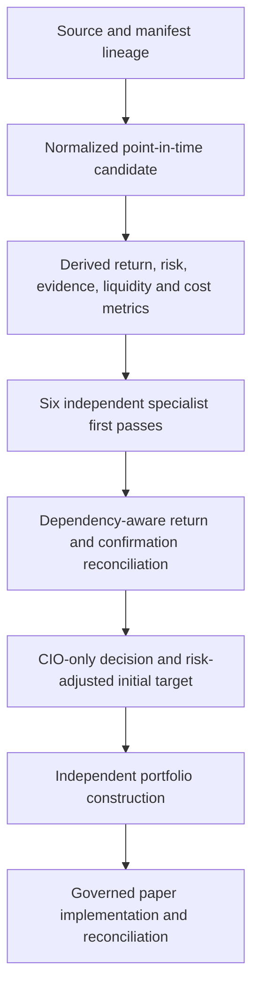

# Committee and CIO Audit

## Current decision status

The six-specialist and CIO architecture is structurally complete. The remaining conclusion is deliberately narrower:

- the decision process is suitable for governed paper testing;
- correlated specialist evidence is now discounted throughout return reconciliation, growth-stage qualification, alignment, coverage, disagreement dispersion and CIO confidence;
- the final decision packet now preserves the complete committee handoff and a structured action ladder;
- the post-decision trace freezes the complete point-in-time portfolio and construction context;
- the strategy, thresholds, specialist mandates, CIO authority, construction boundary and paper-only execution boundary are unchanged; and
- investment skill and threshold calibration remain unproven until representative production and historical cycles reach every decision stage.

No production journal was included in the repository audit artifact. This remains a source, contract and instrumentation assessment rather than a performance or alpha claim.

## Active evidence and authority path

There is no separate voting committee with investment authority. The six specialists produce advisory analyses. The CIO alone issues the canonical investment action. Construction may reduce or reject an approved target but cannot originate an action or increase the CIO target.

## Six-specialist responsibilities

| Specialist | Unique contribution | Missing or stale behavior | Authority |
|---|---|---|---|
| Macro & Economic Strategist | Regime, policy, liquidity and systemic-risk return context | Requires governed production context; upstream evidence governance owns freshness | Advisory return impact only |
| Market Strategist | Trend, breadth, positioning, volatility and liquidity condition | Stale market evidence is blocked through evidence governance | Advisory return impact only |
| Cross-Asset Forecast Specialist | Calibrated forward distribution, cross-asset scenarios and path risk | Missing or failed quality gates cause abstention and zero impact | Advisory scenario adjustment only |
| Fundamental & Valuation Analyst | Independent valuation, quality, growth and return-driver challenge | Missing applicable analysis causes abstention and may create an evidence veto | Advisory return impact only |
| Portfolio & Risk Manager | Feasible ceiling, funding, marginal portfolio effect and implementation feasibility | No feasible target causes abstention; explicit violations create implementation blocks | May block implementation, not issue an action |
| Evidence & Governance Officer | Reliability, freshness, completeness, independence, integrity and reproducibility | Inadequate evidence creates a categorized veto | May veto new or increased exposure, not issue an action |

## Evidence-dependency correction

The active process now uses the same evidence-origin dependency model across all confirmation paths:

1. The return reconciler expands evidence dependencies, identifies shared origins and discounts overlapping specialist return impacts.
2. The growth ensemble calculates effective engine count, coverage, supportive ratio, alignment and disagreement dispersion using evidence-independence weights rather than raw role counts.
3. CIO confidence uses dependency-adjusted directional support, independent confidence, evidence independence and effective specialist coverage.
4. Raw specialist conclusions remain preserved so discounting cannot hide dissent, abstention or limitations.

Therefore several specialists repeating one originating fact cannot create the confidence, growth stage or position-size influence of several genuinely independent conclusions.

## Self-contained CIO decision packet

The append-only CIO decision retains its existing schema for compatibility and now includes a versioned machine-readable `decision-context.v1` record. The record preserves:

- every specialist role, position, confidence, conclusion and dependency weight;
- all material opposition and every abstention rather than only the strongest dissent;
- specialist supporting evidence, contradictions, assumptions, risks, limitations and change conditions;
- evidence vetoes and implementation blocks;
- the portfolio specialist's feasible ceiling, funding source and expected portfolio contribution;
- current and recommended candidate weight;
- the best competing use of capital, effective opportunity cost and cash-relative edge;
- the exact policy requirements for buying or increasing; and
- the governed conditions for holding, reducing and exiting.

Benchmark-relative attractiveness is explicitly recorded as unavailable unless an approved point-in-time benchmark return is supplied. Benchmarks remain evaluation tools and do not become a second optimization objective.

## Complete post-decision trace

The `committee-cio-information-trace.v2-self-contained` event freezes, for each completed decision:

- source and manifest lineage;
- the normalized candidate and point-in-time fingerprint;
- derived return, downside, probability, evidence, liquidity and cost metrics;
- all six specialist inputs and outputs;
- pairwise source overlap and dependency weights;
- the complete CIO context and action ladder;
- portfolio value, cash, positions, sectors, factors and correlation buckets;
- the active-universe and scenario-set lineage; and
- construction targets, cash, turnover, cost, expected improvement and blocks.

The trace is diagnostic and reproducibility evidence only. A trace failure cannot alter or suppress the immutable CIO result.

## Remaining limitations

The architecture corrections do not establish investment skill. The following evidence is still required:

1. Representative completed production paper cycles through screening, specialists, CIO, construction and implementation.
2. A certified historical replay of the actual decision-eligible universe across multiple regimes.
3. Calibration of forecast probabilities and CIO confidence against realized outcomes.
4. Evaluation of correct abstentions, missed opportunities, sizing efficiency, timing, costs and opportunity selection.
5. Provider runtime validation and formal provider/data certification for every required domain.
6. Human-governed champion-versus-challenger review before any policy or threshold change.

## Acceptance, deployment and rollback

- Exactly six specialist roles must reconcile to every CIO decision.
- Dependency-adjusted confirmation metrics must never exceed their raw equivalents through duplicated evidence.
- The decision-context record and trace must preserve all disagreements and limitations.
- Source, candidate, decision, target and construction identifiers must reconcile.
- Runtime provider reports must contain credential names and redacted evidence only, never secret values.
- Migration: none; records append to existing journals and operational report paths.
- Rollback: redeploy the prior code and retain already-appended audit history.
- Strategy, thresholds, CIO authority, construction authority, execution authority and real-money authority changed: **no**.
